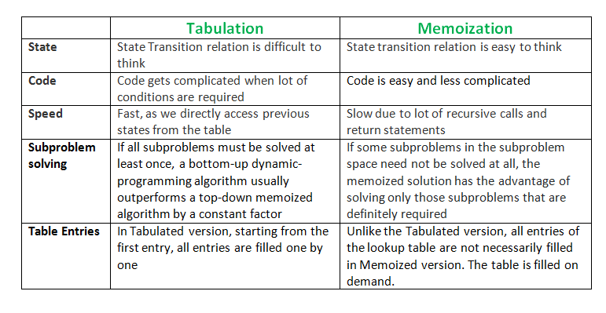

# Dynamic Programming
* Helpful to think of pseudo-code where you will be writing...
  - "some function you want to maximize"
* The hardest part is coming up with this function.
* Requirements for this function:
  - can be easily obtained from answers to smaller problems
  - can order problems in a sequence
  - have a base case

## Approaches
###Top-Down
* Memoization: whenever you calculate something, store it
* As size increases as system may not be able to handle many recursive calls.
* __Do not__ have to "fill all the cells" or "solve every case".

### Bottom-Up
* Also store things... but do so by a "bottom up approach" (or making
  calculations starting with the "leaf nodes").
  
* __Does__ have to "fill all the cells".

## Basic Learneing Examples Problems
* Robot-coin
* Knapsack
